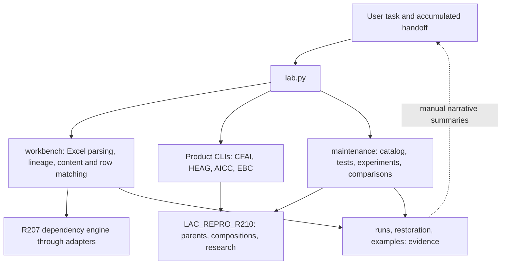
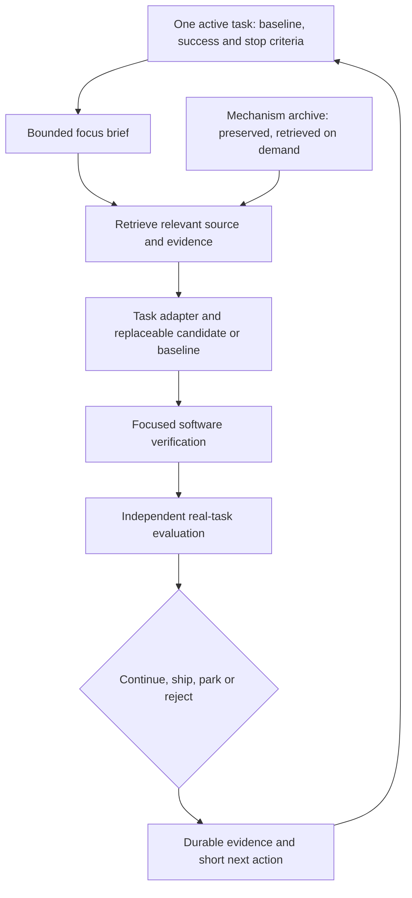

# LabAllCompass: a smaller operating layer, a stronger evidence loop

17 September 2026. Decision: retain the working code, repaired mechanisms and
evidence; replace the default workflow around them. The user's priority is faster
progress with fewer tokens. A full rewrite would discard useful repairs without
resolving the lack of a measured product objective.

## What exists today

Live inventory: 293 component entries: 69 parents, 145 Foundry, 52 V2,
5 recovered V2, 18 research rounds, 2 active products and 2 material products.
These are inventory categories, not 293 validated products. Among Foundry entries,
89 use generic spec_runtime and 20 shared reference reconstructions; neither
inherits missing historical implementation claims. P083/P103 are new native
reimplementations. Counts come from the current catalog collector, not GitHub.

The original V2 core already contains experiment contracts, selection and
telemetry. Its bootstrap explicitly treats test-case coverage as a finite
software measure. Building another general research orchestrator would duplicate
that machinery. It still does not supply product outcomes for the current UI.

Concrete friction found in this checkout:

- Startup instructions required 43,784 UTF-8 bytes / 5,060 words across three
  documents, before relevant code or evidence. Old permission/network statements
  coexisted with newer corrections.
- Exact `show ID` parsed source for the entire catalog. Component listings were
  unbounded. Historical PASS observations were displayed without source-freshness
  clarification.
- The old `all` profile included restoration regressions but omitted the main
  application tests. Run snapshots omitted workbench and lab.py sources.
- The experiment runner copies the whole roughly 465 MB package to preserve
  cross-component imports. It explicitly is not an OS security sandbox.
- The workbench uses R207, while its recorded equally batched AND/OR comparison
  found no advantage. Real files and software tests exist; evidence of superior
  reviewer outcomes remains incomplete.

## Comparison with relevant leading work

These are well-documented comparators, not an objective ranking of the world's
best labs. I inspected public primary descriptions and FunSearch's evaluator
source; I did not reproduce their research or benchmark this lab against their
private systems. Their scale and domains differ substantially from this lab.

| Comparator | Documented practice | Transfer to this lab | Boundary |
| --- | --- | --- | --- |
| DeepMind AlphaEvolve | Propose programs, evaluate them automatically, retain results for subsequent search. [Primary description](https://deepmind.google/blog/alphaevolve-a-gemini-powered-coding-agent-for-designing-advanced-algorithms/) | Put the evaluator and strong baseline before candidate expansion; retain counterexamples and costs. | Google's reported infrastructure/algorithm successes do not establish benefits for our product. |
| DeepMind FunSearch | Its evaluator executes candidate programs on specified inputs, then registers scored results. [Evaluator source](https://raw.githubusercontent.com/google-deepmind/funsearch/main/implementation/evaluator.py) | Candidate output is evaluated by a separately maintained problem harness. | The public Sandbox is unimplemented; downloading it would not give us safe execution. |
| Sakana AI Scientist-v2 | Experiment-manager-guided tree search; its README warns broader exploration can have lower success rates than a strong template. [Repository](https://github.com/SakanaAI/AI-Scientist-v2) | Reuse a concrete problem template and bounded search before adding autonomy. | Primarily ML research and manuscript generation; acceptance of a paper is not customer value. Its execution warning is relevant. |
| Google AI co-scientist | Hypothesis generation/ranking followed by expert involvement and laboratory experiments for selected applications. [Primary report](https://research.google/blog/accelerating-scientific-breakthroughs-with-an-ai-co-scientist/) | Separate proposed value from external validation. | Hypothesis ratings are not measured product quality. Our lab is computational, not a biomedical wet lab. |
| Anthropic agent engineering | Retrieve context just in time; distinguish a stated action from the actual resulting state. [Context](https://www.anthropic.com/engineering/effective-context-engineering-for-ai-agents), [evaluation](https://www.anthropic.com/engineering/demystifying-evals-for-ai-agents) | Short task briefs, local source pointers, durable traces and outcome-based evaluation. | Context byte savings are not measured token billing or an assurance of better reasoning. |

Architecture choice is my synthesis of these practices and the local evidence.
No new vendor, subscription, model setting, agent swarm or framework was added.

## Target architecture and implementation boundary

The brief, retrieval and software-verification improvements are implemented.
Real-task evaluation and product promotion are explicit operating requirements,
not a newly automated gate. No new product quality result is claimed.

| Layer | Owner / current files | Contract |
| --- | --- | --- |
| Current work | `lab-focus.json`, `maintenance/focus.py` | Exactly one active mission; baseline, success/stop criteria and existing evidence paths required; output capped at 6,000 UTF-8 bytes. A local policy limit, not a tokenizer limit. |
| Retrieval | `maintenance/components.py`, `catalog.py` | Exact ID parses matching component files only; listings paginate; no catalog write on lookup. |
| Product | `workbench/`, existing product CLIs | File/task adapters keep domain semantics. No universal matrix-shaped mechanism API. |
| Mechanisms | Existing LAC paths | Preserve imports and fidelity labels. Extract shared packages only when a selected product and its consumers justify migration. |
| Software evidence | `maintenance/runner.py`, `tests/`, `runs/` | Focused and all profiles, subprocess logs and source hashes. Historical results remain historical. No automatic skip based on incomplete fingerprints. |
| Comparative evidence | Existing benchmarks, `maintenance/compare.py`, `examples/` | Same inputs and budgets, explicit exclusions and negative results. The comparison code accepts supplied scores; independence and grader integrity require separate checking. |
| History | `restoration/`, research records, old receipts | Read on demand. Completed experiments are not default startup work. |

## Operating and quality policy

Default loop: select one useful outcome, read its brief and relevant evidence,
inspect source/callers, change only what the outcome requires, test affected
consumers, record the decision and next unresolved action. Broaden testing for
shared infrastructure or detected failures. Whole-lab tests remain available.
Each result needs a source/data version; an old PASS cannot automatically certify
new code. The new runner's expanded hashes still cover Python only, so data,
environment and external state remain separate evidence.

For a product comparison, predeclare inputs, source-family grouping, baseline,
metric and budget before judging a candidate. Freeze the grader separately from
candidate edits. Use held-out families when tuning. Report correctness failures,
coverage, latency and reviewer effort separately. If the grader changes, start a
new comparable series. Human labels and user trials must not be replaced by the
candidate's own description of success.

Start the existing workbook-version pilot provisionally: it already has source
adapters and genuine public files. It has the shortest visible path to a task
someone can inspect. This is an engineering prioritization, not market research.
Keep information-selection parked until a real decision task supplies defensible
cost, utility and covariance inputs. Keep other mechanisms discoverable.

Stop rules: bound initial real-pair acquisition to one focused session; reassess
if unavailable. Avoid adding an advanced mechanism when a simple baseline solves
the task. After validating this operating slice, stop building infrastructure.
If later comparable tasks show no net savings, revise the brief policy instead
of expanding it. Arbitrary test thresholds, including ACSA's five-group floor,
remain engineering choices until independent calibration supports stronger claims.

## Token/cost measurement and staged migration

Measure total tokens per accepted outcome when actual per-task usage is available,
with failed attempts, retries and reopened work included. Also track elapsed time,
regressions and real-task quality. Do not optimize for fewer tokens by weakening
the acceptance criteria. This session can measure local text volume and lookup
work/time, not total future token savings; model billing logs are not available.

1. **Implemented here:** compact startup with preserved history, bounded focus,
   selective lookups, paginated results, quiet runs, historical labels and complete
   application-test discovery. See the validation record for actual measurements.
2. **Next product slice:** acquire and label two genuine workbook versions; run
   a simple diff/graph baseline and current matcher on identical files. Deliver
   the useful differences/impact view and report misses, false positives and cost.
3. **Only if justified:** migrate selected canonical mechanisms behind tested
   adapters; remove embedded duplicates only after consumer-equivalence checks.
   Optimize experiment copying with explicit dependency manifests after testing
   import/data completeness. A directory copy alone is never a sandbox.
4. **Only after repeated outcome evidence:** automate candidate search, incremental
   test reuse, or model routing. Cache reuse would need complete source, data,
   dependency, evaluator and relevant environment fingerprints plus output
   integrity. The current Python snapshots are insufficient for that promise.

No source archive, old output or original workbook was deleted. No package
manifest rewrite was necessary because this slice did not edit packaged code.
The previous strategy/handoff and changed infrastructure files are preserved in
`restoration/20260917-architecture/before/`.
